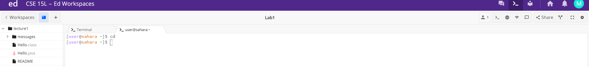
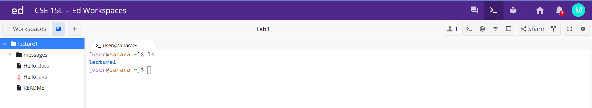
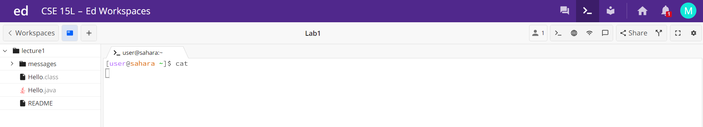
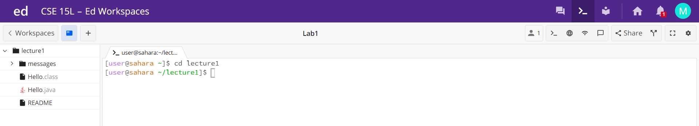
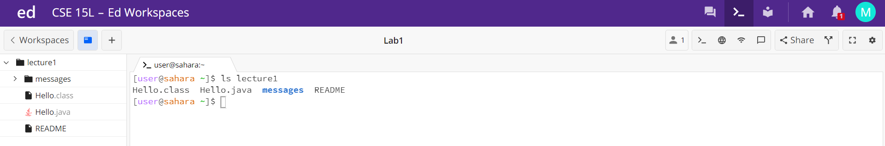
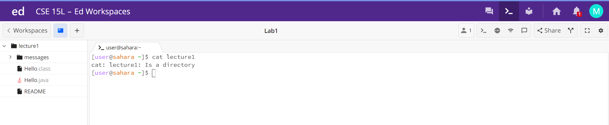
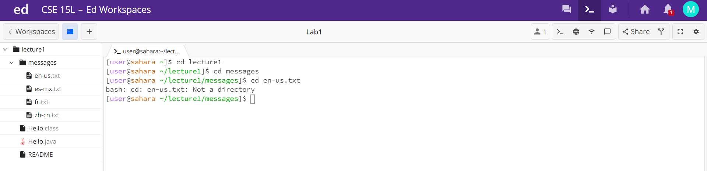
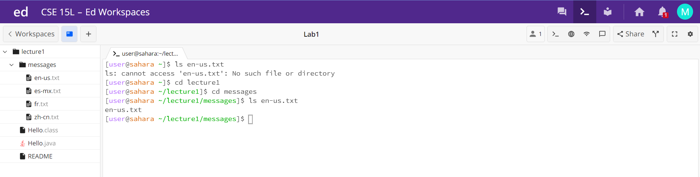
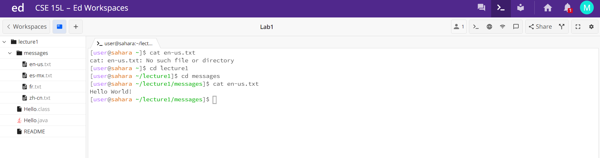

1. No Arguments

The directory was switched to /home. Because there was no argument, the working directory was "changed" to /home, even though the working directory was already /home. If the working directory had been /home/lecture1 or /home/lecture1/messages, the working directory would have changed to /home if there was no argument given. The directory changed as intended, so there was no error. The working directory was /home.

lecture1 was printed out. There was no argument, but there was a current directory: the home one. lecture1 was the only item in the /home directory, and so only it was printed out. There was no error. The working directory was /home.

Nothing happened. cat prints out the contents of a file, but there was no argument given, so nothing was printed out. In the screenshot, the cursor is still waiting for an input, but no error message was thrown, so this is not an error. The working directory was /home.
3. Directory Argument

The working directory was changed to /home/lecture1. cd changes the directory to the given input, and since lecture1 was input and was inside the /home directory, the directory was changed. Things worked as intended, so there was no error. The working directory was initially /home, but changed to /home/lecture1.

The contents of the lecture1 directory were printed out. The argument was lecture1, and so the program printed out lecture1's contents. There was no error. The working directory was /home.

A notice was printed out that lecture1 was a directory, and thus could not have its contents printed out because it wasn't a file. This is an error because nothing happened, though the platform seems to have anticipated it and thrown a message when the error occurred. The working directory was /home.
5. File Argument

A notice was printed out that en-us.txt was not a directory, and so the directory couldn't be changed to that input. This is an error because nothing happened, though the platform seems to have anticipated it and thrown a message when the error occurred. The working directory was /home/lecture1/messages.

en-us.txt was printed out. The argument was en-us.txt, and so ln printed out the name of the file. There was no error. The working directory was /home/lecture1/messages.

Hello World! was printed out. The argument was en-us.txt, and since cat prints out the contents of a file and the argument was a file, the file's contents were printed. There was no error. The working directory was /home/lecture1/messages.
