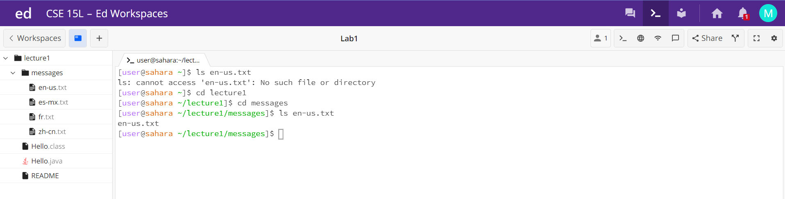

1. No Arguments

Nothing happened. There was no argument, but if there was one it would have changed the directory to the given input. There was nothing to change to, and so nothing changing was no error. There was no output because changing directory to nothing doesn't do anything. The working directory was /home.

lecture1 was printed out. There was no argument, but there was a current directory: the home one. lecture1 was the only item in the home directory, and so only it was printed out. There was no error. The working directory was /home.

3. Directory Argument

4. File Argument

