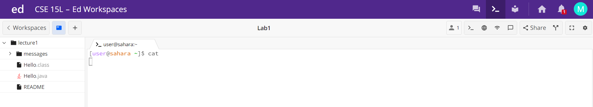
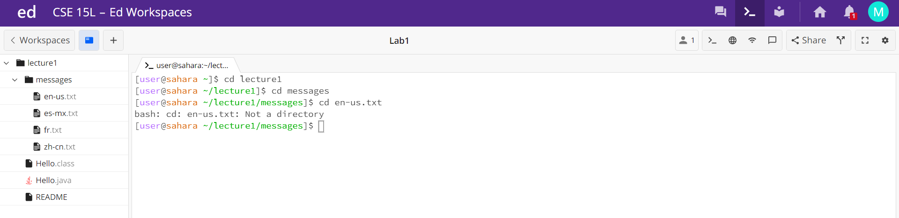
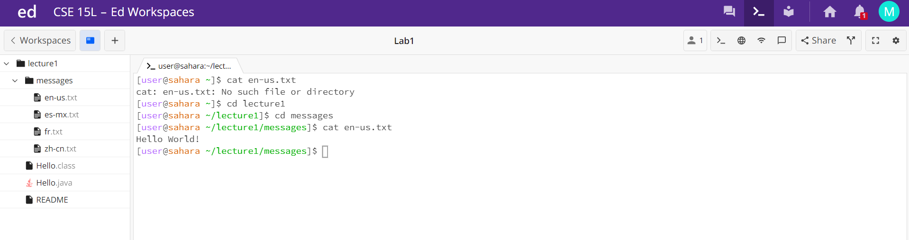

1. No Arguments

Nothing happened. There was no argument, but if there was one it would have changed the directory to the given input. There was nothing to change to, and so there was no error. There was no output because changing directory to nothing doesn't do anything.

2. Directory Argument

3. File Argument

